# TC Branch Automation - Event Scenarios & Diagrams

이 문서는 TC 브랜치 자동화 시스템에서 발생할 수 있는 모든 예상 시나리오에 대한 이벤트 다이어그램을 포함합니다.

---

## 1. 기본 개념 및 상태 정의

### 1.1 시스템 구성 요소

| 구성 요소 | 설명 |
|-----------|------|
| **Engine Repo** | `CUBRID/cubrid` - 엔진 코드 저장소, 워크플로우 실행 위치 |
| **TC Public** | `CUBRID/cubrid-testcases` - 공개 테스트 케이스 |
| **TC Private** | `CUBRID/cubrid-testcases-private-ex` - 비공개 테스트 케이스 |
| **TC Branch** | `tc/pr-{N}` - PR 번호 기반 TC 브랜치 |
| **GitHub App** | TC 저장소에 쓰기 권한을 가진 인증 메커니즘 |

### 1.2 상태 정의

```
[NO_BRANCH] ──► [CREATED] ──► [TESTING] ──► [MERGED_TO_DEVELOP] ──► [DELETED]
                    │              │              │
                    ▼              ▼              ▼
              [REVERTED]    [CONFLICT]     [MERGE_FAILED]
```

| 상태 | 설명 |
|------|------|
| `NO_BRANCH` | TC 브랜치가 아직 생성되지 않음 |
| `CREATED` | `tc/pr-N` 브랜치가 develop에서 생성됨 |
| `TESTING` | CI가 TC 브랜치를 사용하여 테스트 실행 중 |
| `MERGED_TO_DEVELOP` | TC 브랜치가 develop에 squash merge됨 |
| `DELETED` | TC 브랜치가 삭제됨 |
| `REVERTED` | Revert PR에 의해 TC 변경사항이 revert됨 |
| `CONFLICT` | TC 브랜치와 develop 간 충돌 발생 |
| `MERGE_FAILED` | Merge 작업 실패 |

---

## 2. 시나리오 분류

### Category A: Happy Path (정상 흐름)
| 시나리오 ID | 설명 |
|-------------|------|
| **A1** | 일반 PR 열림 → TC 브랜치 생성 → TC 머지 → 엔진 PR 머지 → TC 브랜치 삭제 |
| **A2** | Revert PR 열림 → 원본 TC 커밋 Revert → Revert PR 머지 → TC Revert 머지 |

### Category B: Edge Cases (경계 조건)
| 시나리오 ID | 설명 |
|-------------|------|
| **B1** | TC 브랜치가 이미 존재함 (재시도/재오픈) |
| **B2** | 원본 PR에 TC 변경사항이 없었음 (Revert 시나리오) |
| **B3** | PR이 머지되지 않고 닫힘 (TC 브랜치만 삭제) |
| **B4** | 엔진 PR이 머지된 후 TC 머지가 실패함 |

### Category C: Error Scenarios (오류 상황)
| 시나리오 ID | 설명 |
|-------------|------|
| **C1** | GitHub App 토큰 생성 실패 |
| **C2** | TC 저장소 접근 권한 없음 |
| **C3** | develop 브랜치가 존재하지 않음 |
| **C4** | TC 브랜치 생성 중 충돌/오류 |
| **C5** | TC squash merge 충돌 |
| **C6** | Revert 작업 충돌 |
| **C7** | 브랜치 삭제 실패 (보호 규칙) |

### Category D: Race Conditions (동시성)
| 시나리오 ID | 설명 |
|-------------|------|
| **D1** | 두 엔진 PR이 동시에 머지 시도 (TC develop 충돌) |
| **D2** | PR이 빠르게 재오픈/닫힘 반복 (sync/finalize 경쟁) |
| **D3** | Revert PR이 원본 TC 머지 전에 열림 |
| **D4** | 동일 TC 저장소에 동시 작업 (Public/Private 병렬 처리) |

### Category E: Synchronize Scenarios (PR 업데이트)
| 시나리오 ID | 설명 |
|-------------|------|
| **E1** | 일반 PR이 Revert PR로 변경됨 (body 수정) |
| **E2** | Revert PR이 일반 PR로 변경됨 (body 수정) |
| **E3** | PR 제목 변경 (헤더 업데이트) |
| **E4** | PR이 synchronize되었으나 TC 브랜치는 이미 존재 |

---

## 3. 이벤트 다이어그램

### 시나리오 A1: 정상 흐름 - 일반 PR 라이프사이클

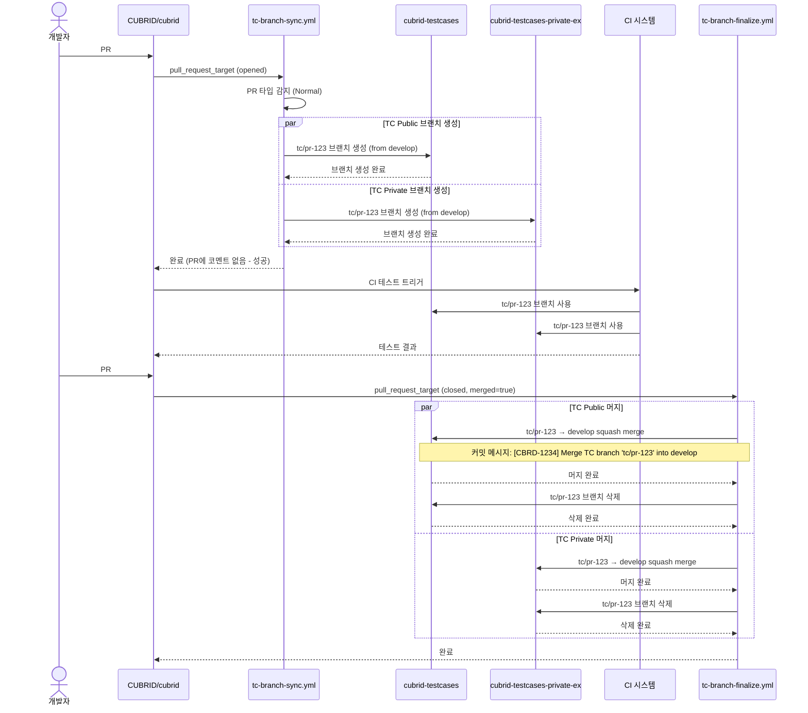

---

### 시나리오 A2: 정상 흐름 - Revert PR 라이프사이클

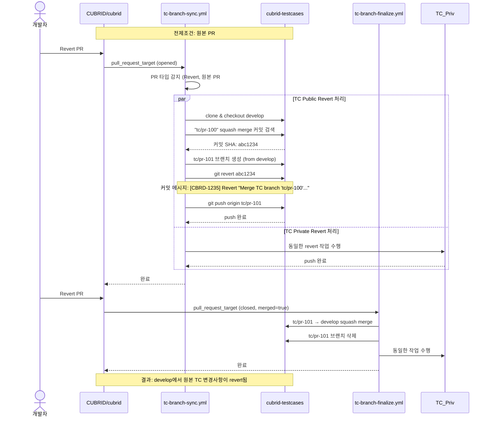

---

### 시나리오 B1: TC 브랜치가 이미 존재함 (멱등성)

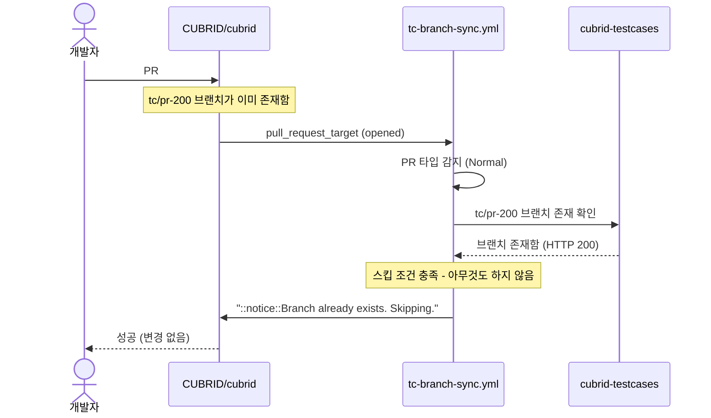

---

### 시나리오 B2: 원본 PR에 TC 변경사항 없음 (Revert 시 빈 브랜치)

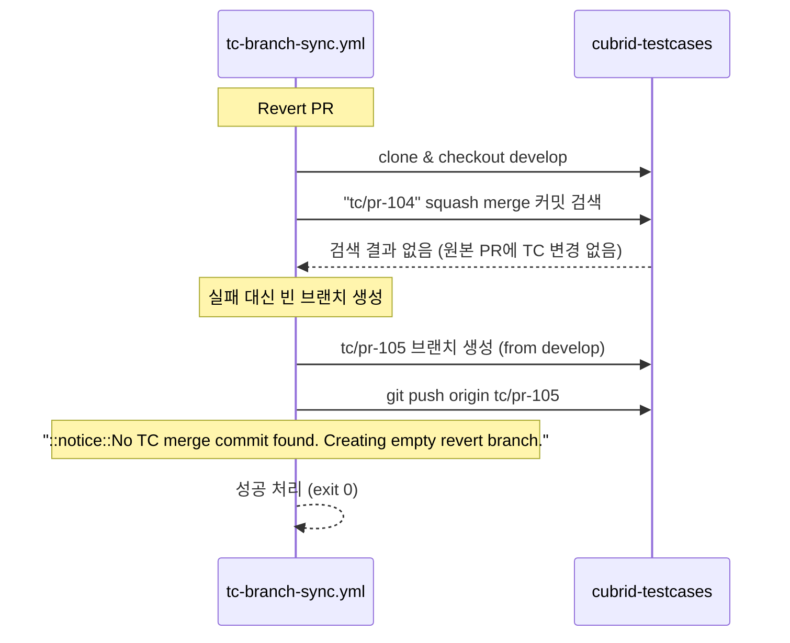

---

### 시나리오 B3: PR이 머지되지 않고 닫힘

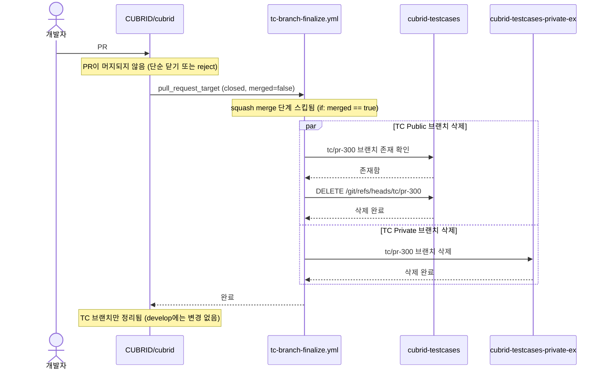

---

### 시나리오 C1-C2: 인증/권한 실패

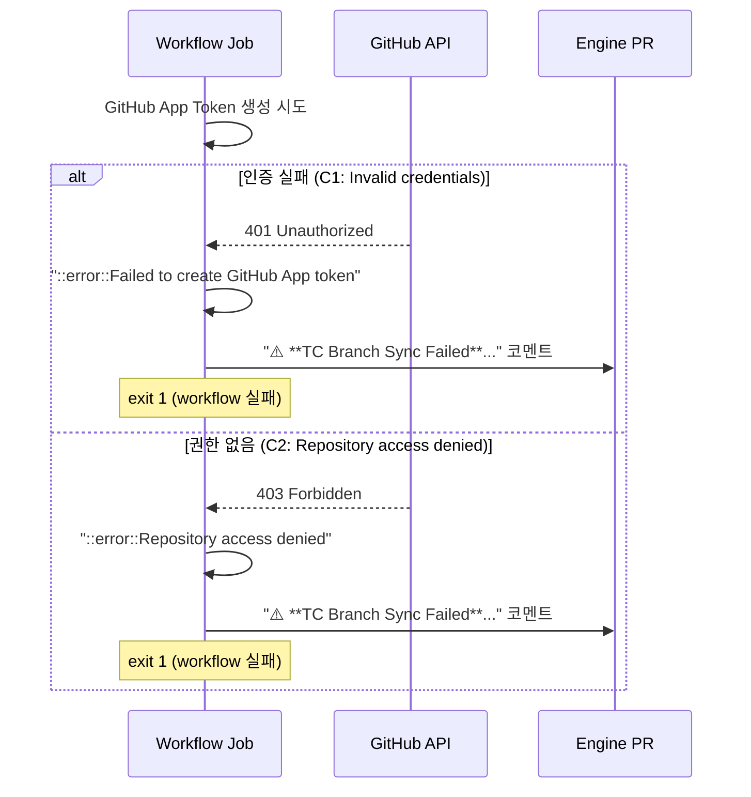

---

### 시나리오 C5: TC Squash Merge 충돌

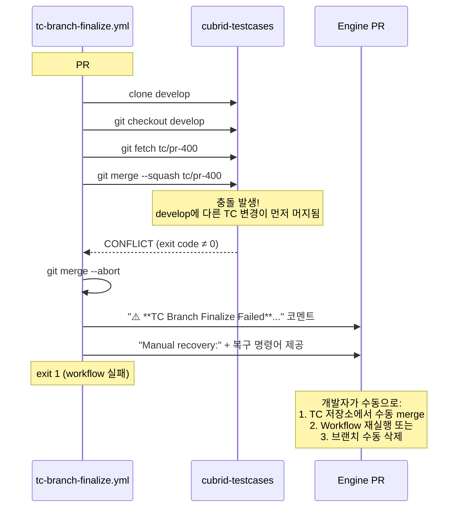

---

### 시나리오 C6: Revert 충돌

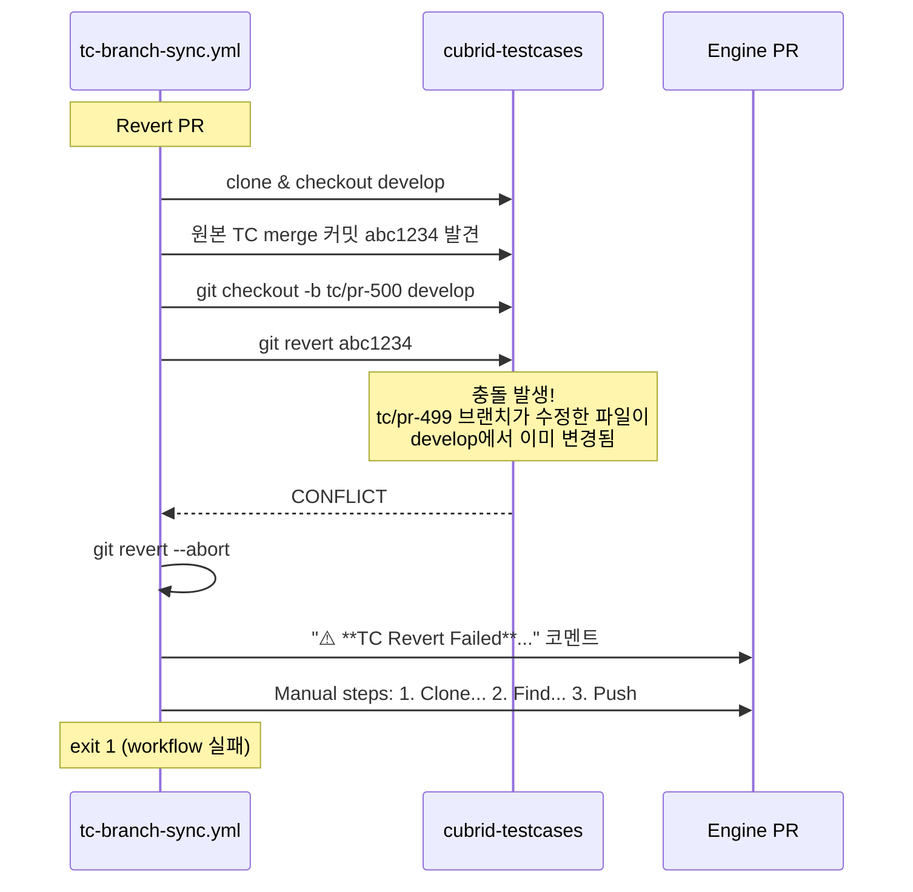

---

### 시나리오 C7: 브랜치 삭제 실패 (보호 규칙)

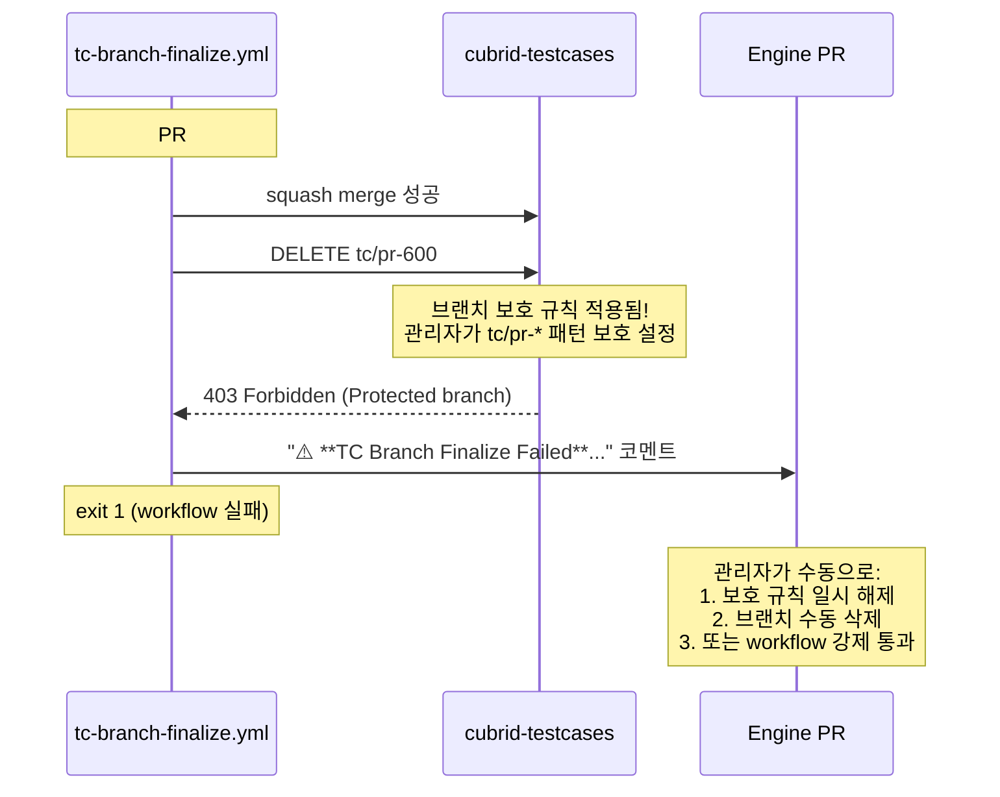

---

### 시나리오 D1: 두 엔진 PR 동시 머지 (Race Condition)

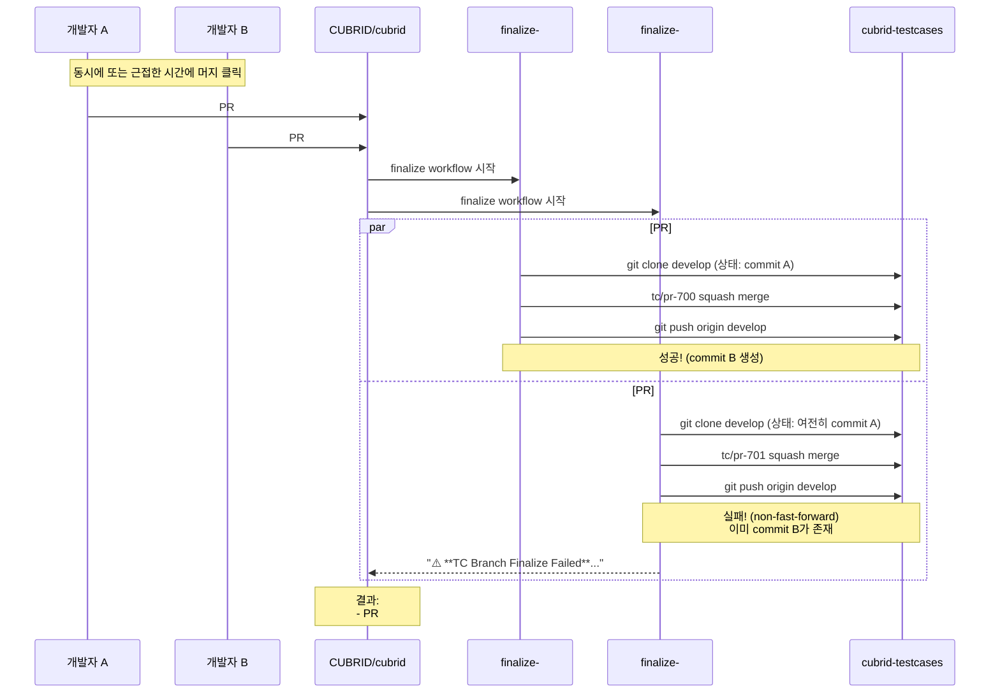

**해결책:** per-repo concurrency 추가 고려
```yaml
concurrency:
  group: tc-develop-${{ matrix.tc-repo }}
  cancel-in-progress: false
```

---

### 시나리오 D2: PR 빠르게 재오픈/닫힘 반복

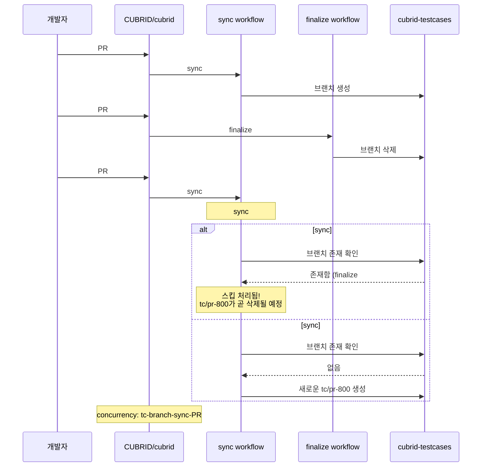

---

### 시나리오 D3: Revert PR이 원본 TC 머지 전에 열림

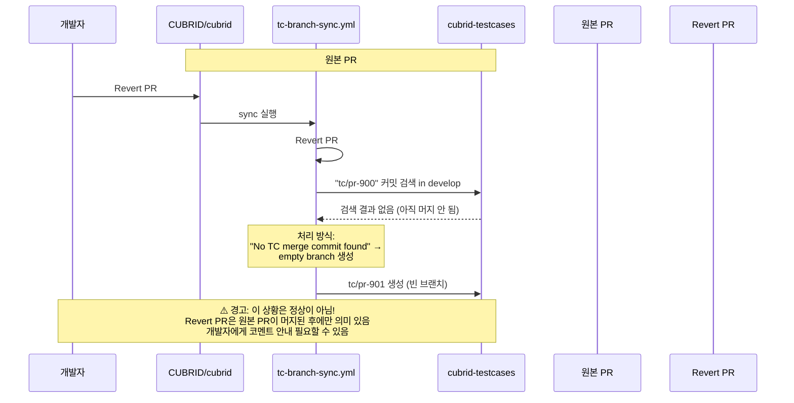

---

### 시나리오 E1-E2: PR 타입 변경 (일반 ↔ Revert)

```mermaid
sequenceDiagram
    participant Dev as 개발자
    participant Engine as CUBRID/cubrid
    participant Workflow_Sync as tc-branch-sync.yml
    participant TC_Pub as cubrid-testcases

    %% E1: Normal → Revert
    Note over Engine: 시나리오 E1: 일반 PR → Revert PR 변경
    Dev->>Engine: PR #1000 열림 (일반 PR)
    Engine->>Workflow_Sync: sync #1 실행
    Workflow_Sync->>TC_Pub: tc/pr-1000 생성
    
    Dev->>Engine: PR #1000 Body 수정: "Reverts #999" 추가
    Engine->>Workflow_Sync: sync #2 (synchronize) 실행
    Workflow_Sync->>Workflow_Sync: 타입 변경 감지 (Normal → Revert)
    
    Note over Workflow_Sync: tc/pr-1000이 이미 존재함<br/>새로운 처리 불가 (스킵됨)
    Workflow_Sync->>TC_Pub: 브랜치 존재 확인
    TC_Pub-->>Workflow_Sync: 존재함
    Workflow_Sync->>Engine: "::notice::Branch already exists. Skipping."
    
    Note over Dev,TC_Pub: ⚠️ 문제: Revert 로직이 실행되지 않음!<br/>tc/pr-1000는 일반 브랜치 상태 유지<br/>개발자가 수동으로 revert 작업 필요
    
    ---
    
    %% E2: Revert → Normal
    Note over Engine: 시나리오 E2: Revert PR → 일반 PR 변경
    Dev->>Engine: PR #1001 열림 (Revert PR)
    Engine->>Workflow_Sync: sync #1 실행
    Workflow_Sync->>TC_Pub: tc/pr-1001 생성 + 원본 커밋 revert
    
    Dev->>Engine: PR #1001 Body 수정: "Reverts #..." 제거
    Engine->>Workflow_Sync: sync #2 (synchronize) 실행
    Workflow_Sync->>Workflow_Sync: 타입 변경 감지 (Revert → Normal)
    
    Workflow_Sync->>TC_Pub: 브랜치 존재 확인
    TC_Pub-->>Workflow_Sync: 존재함 (revert 커밋 포함)
    Workflow_Sync->>Engine: "::notice::Branch already exists. Skipping."
    
    Note over Dev,TC_Pub: 결과: tc/pr-1001는 revert된 상태로 유지됨<br/>개발자가 의도한 것과 다른 결과 가능
```

---

## 4. 상태 전이 표

### TC 브랜치 수명 주기 상태 전이

| 현재 상태 | 이벤트 | 다음 상태 | 조건 |
|-----------|--------|-----------|------|
| **NO_BRANCH** | PR Opened (Normal) | CREATED | 브랜치 생성 성공 |
| **NO_BRANCH** | PR Opened (Normal) | NO_BRANCH | 브랜치 이미 존재 |
| **NO_BRANCH** | PR Opened (Revert) | CREATED | Revert 성공 |
| **NO_BRANCH** | PR Opened (Revert) | CREATED (empty) | 원본 커밋 없음 |
| **CREATED** | PR Synchronize | CREATED | 브랜치 존재 (스킵) |
| **CREATED** | CI Test | TESTING | CI 트리거됨 |
| **TESTING** | CI Complete | TESTING | 결과无关 |
| **CREATED/TESTING** | PR Closed (not merged) | NO_BRANCH | 브랜치 삭제 |
| **CREATED/TESTING** | PR Closed (merged) | MERGED_TO_DEVELOP | squash merge 성공 |
| **CREATED/TESTING** | PR Closed (merged) | MERGE_FAILED | 충돌 발생 |
| **MERGED_TO_DEVELOP** | Delete Step | DELETED | 삭제 성공 |
| **MERGED_TO_DEVELOP** | Delete Step | MERGED_TO_DEVELOP | 삭제 실패 |
| **CREATED** | Revert PR Processed | REVERTED | Revert 커밋 푸시됨 |

---

## 5. 오류 복구 매뉴얼

### 시나리오별 복구 절차

#### C5: TC Merge 충돌 복구
```bash
# 1. 수동 머지 수행
BRANCH="tc/pr-1234"
git clone -b develop https://github.com/CUBRID/cubrid-testcases.git
cd cubrid-testcases
git fetch origin "${BRANCH}:${BRANCH}"
git merge --squash "${BRANCH}"
# 충돌 해결 후
git commit -m "[CBRD-XXXX] Merge TC branch '${BRANCH}' into develop"
git push origin develop

# 2. 브랜치 삭제
git push origin --delete "${BRANCH}"
```

#### C6: Revert 충돌 복구
```bash
# 1. Revert 브랜치 수동 생성
BRANCH="tc/pr-1234"
ORIGINAL_PR="123"
git clone -b develop https://github.com/CUBRID/cubrid-testcases.git
cd cubrid-testcases

# 2. 원본 TC merge 커밋 찾기
git log --oneline --grep="tc/pr-${ORIGINAL_PR}" develop
# 커밋 SHA 확인 (예: abc1234)

# 3. Revert 브랜치 생성 및 revert 수행
git checkout -b "${BRANCH}" develop
git revert -m 1 abc1234  # 또는 git revert abc1234 (squash인 경우)
# 충돌 해결 후
git push origin "${BRANCH}"
```

#### C7: 보호된 브랜치 삭제
```bash
# 관리자 권한으로 API 호출
curl -X DELETE \
  -H "Authorization: Bearer ${ADMIN_TOKEN}" \
  -H "Accept: application/vnd.github+json" \
  "https://api.github.com/repos/CUBRID/cubrid-testcases/git/refs/heads/tc/pr-1234"
```

---

## 6. 이벤트 흐름 요약

### 전체 시스템 이벤트 다이어그램

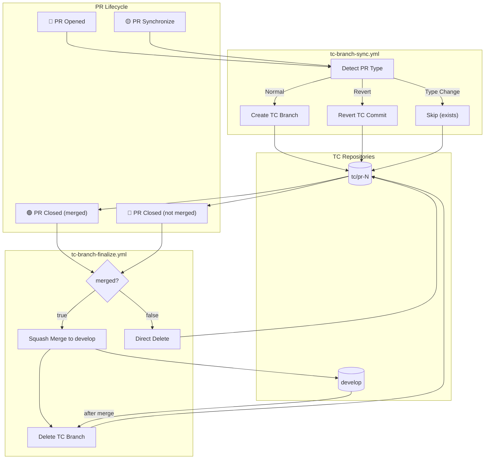

---

## 7. 체크포인트 및 검증

### 각 단계별 검증 항목

| 단계 | 검증 항목 | 성공 기준 |
|------|-----------|-----------|
| **PR 파싱** | `is_revert`, `original_pr_number`, `pr_header` 추출 | 모든 출력값이 예상 범위 내 |
| **토큰 생성** | GitHub App 인증 | 200 OK, 유효한 토큰 반환 |
| **브랜치 생성** | tc/pr-N 생성 | HTTP 201, refs/heads/tc/pr-N 존재 |
| **Revert** | 원본 커밋 발견 및 revert | Revert 커밋이 tc/pr-N에 존재 |
| **Squash Merge** | tc/pr-N → develop | develop에 새 커밋 생성 |
| **브랜치 삭제** | tc/pr-N 제거 | HTTP 204, refs/heads/tc/pr-N 없음 |
| **코멘트** | 실패 시 PR 코멘트 | PR에 에러 메시지 표시됨 |

---

## 8. 빈도 및 우선순위

### 시나리오 발생 빈도 추정

| 시나리오 | 예상 빈도 | 우선순위 |
|----------|-----------|----------|
| A1 (정상 일반 PR) | **매우 높음 (80%)** | P0 |
| A2 (정상 Revert PR) | **낮음 (5%)** | P1 |
| B1 (브랜치 이미 존재) | **중간 (10%)** | P1 |
| B2 (TC 없는 Revert) | **낮음 (3%)** | P2 |
| B3 (닫힘 without 머지) | **낮음 (2%)** | P1 |
| C1-C2 (인증 실패) | **매우 낮음 (<1%)** | P0 (치명적) |
| C5 (Merge 충돌) | **낮음 (1%)** | P1 |
| C6 (Revert 충돌) | **매우 낮음 (<1%)** | P2 |
| C7 (삭제 실패) | **매우 낮음 (<1%)** | P2 |
| D1 (동시 머지) | **매우 낮음 (<1%)** | P1 |
| E1-E2 (타입 변경) | **매우 낮음 (<1%)** | P2 |

---

*문서 버전: 1.0*
*생성일: 2026-02-27*
*적용 워크플로우: tc-branch-sync.yml, tc-branch-finalize.yml*
